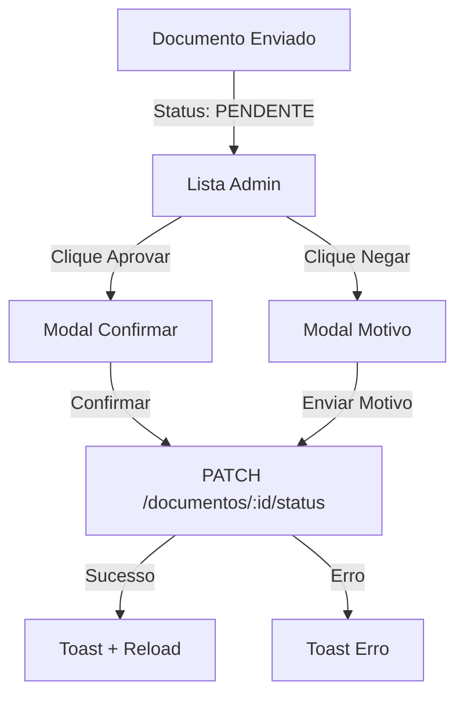

# 🎉 Painel Admin - DespaFacil

## ✅ Funcionalidades Implementadas

### 1. **Gestão de Documentos**
- ✅ Listagem completa de todos os documentos enviados
- ✅ Exibição de informações do motorista (nome, CPF)
- ✅ Tipo de documento (CNH, Comprovante, Documento1, Documento2)
- ✅ Status visual com badges coloridos (Pendente, Aprovado, Negado)
- ✅ Data de upload formatada
- ✅ Nome do arquivo original

### 2. **Aprovação e Negação**
- ✅ Botões de aprovar (✓) e negar (✗) para documentos pendentes
- ✅ Modal de confirmação com informações do documento
- ✅ Campo obrigatório de motivo para negação
- ✅ Validação de campos
- ✅ Loading state durante ação
- ✅ Toast de sucesso/erro
- ✅ Atualização automática da lista após ação

### 3. **Busca e Filtros**
- ✅ Busca por nome ou CPF do motorista (em tempo real)
- ✅ Filtro por status (Todos, Pendente, Aprovado, Negado)
- ✅ Filtro por tipo de documento (Todos, CNH, Comprovante, Doc1, Doc2)
- ✅ Contadores visuais de documentos por status

### 4. **Envio de Certificados**
- ✅ Modal dedicado para envio
- ✅ Upload de arquivo PDF com validação
- ✅ Limite de 10MB por arquivo
- ✅ Campo de busca de motorista (nome ou CPF)
- ✅ Validação de campos obrigatórios
- ✅ Feedback visual do arquivo selecionado
- ✅ Integração com backend para envio por e-mail
- ✅ Toast de confirmação

### 5. **Exportação de Dados**
- ✅ Botão de exportar para CSV/XLSX
- ✅ Aplica filtros ativos na exportação
- ✅ Download automático do arquivo
- ✅ Toast de progresso e conclusão

### 6. **UI/UX**
- ✅ Design moderno e responsivo
- ✅ Header fixo com informações do usuário
- ✅ Botão de atualizar lista com loading state
- ✅ Animações suaves (Framer Motion)
- ✅ Cores consistentes com tema
- ✅ Dark mode suportado
- ✅ Tabela com linhas alternadas e hover
- ✅ Cards de estatísticas coloridos
- ✅ Ícones intuitivos (Lucide React)

## 📦 Componentes Criados

### **Select** (`/components/ui/select.tsx`)
- Componente de seleção com label e erro
- Usado nos filtros de status e tipo

### **Textarea** (`/components/ui/textarea.tsx`)
- Área de texto com label e validação
- Usado no motivo de negação

### **DocumentoActionDialog** (`/components/admin/DocumentoActionDialog.tsx`)
- Modal de aprovação/negação
- Validação de motivo para negação
- Informações do documento

### **SendCertificadoDialog** (`/components/admin/SendCertificadoDialog.tsx`)
- Modal de envio de certificado
- Upload de PDF com validação
- Busca de motorista

### **AdminPage** (`/app/admin/page.tsx`)
- Página principal do painel admin
- Integração com todos os endpoints
- Gerenciamento de estado completo

## 🔌 Integração Backend

### Endpoints Utilizados:
- `GET /api/admin/documentos` - Listar documentos
- `PATCH /api/documentos/:id/status` - Aprovar/Negar
- `POST /api/admin/certificados/send` - Enviar certificado
- `GET /api/admin/export` - Exportar CSV/XLSX

## 🎨 Estrutura Visual

```
┌─────────────────────────────────────────────────────────────┐
│  🔹 DespaFacil - Admin          👤 Admin Name   [Sair]      │
├─────────────────────────────────────────────────────────────┤
│                                                             │
│  📊 Gestão de Documentos                                    │
│  [Atualizar] [Exportar] [Enviar Certificado]               │
│                                                             │
│  [Buscar motorista...] [Status▾] [Tipo▾]                  │
│                                                             │
│  📊 5 Pendentes  ✓ 3 Aprovados  ✗ 2 Negados               │
│                                                             │
│  ┌──────────────────────────────────────────────────────┐  │
│  │ Motorista | CPF | Tipo | Arquivo | Status | Data | ⚡ │  │
│  ├──────────────────────────────────────────────────────┤  │
│  │ João Silva | 123... | CNH | doc.pdf | 🟡 Pendente | │  │
│  │                                        [✓] [✗]         │  │
│  └──────────────────────────────────────────────────────┘  │
└─────────────────────────────────────────────────────────────┘
```

## 🚀 Como Testar

### 1. **Acessar o Painel Admin**
```
http://localhost:3000/admin
```

### 2. **Login com Admin**
```
Email: theostracke11@gmail.com
Senha: SenhaForte123!
```

### 3. **Testar Funcionalidades**
- ✅ Visualizar lista de documentos
- ✅ Filtrar por status/tipo
- ✅ Buscar motorista
- ✅ Aprovar documento pendente
- ✅ Negar documento com motivo
- ✅ Enviar certificado PDF
- ✅ Exportar dados para Excel

## 📝 Fluxo de Aprovação



## 🎯 Próximos Passos Sugeridos

### Opção 1: Testar Integração Completa
- ✅ Backend rodando: http://localhost:4000
- ✅ Frontend rodando: http://localhost:3000
- Testar fluxo completo:
  1. Login despachante → Cadastrar motorista → Upload documentos
  2. Login admin → Aprovar/Negar documentos
  3. Enviar certificado por e-mail
  4. Exportar relatório

### Opção 2: Preparar Deploy
- **Frontend (Vercel):**
  - Conectar repositório GitHub
  - Configurar variável `NEXT_PUBLIC_API_URL`
  - Deploy automático

- **Backend (Railway):**
  - Conectar repositório GitHub
  - Configurar PostgreSQL add-on
  - Variáveis de ambiente (JWT_SECRET, DATABASE_URL, SMTP)
  - Deploy automático

---

**Status:** ✅ Painel Admin 100% funcional e pronto para testes!
