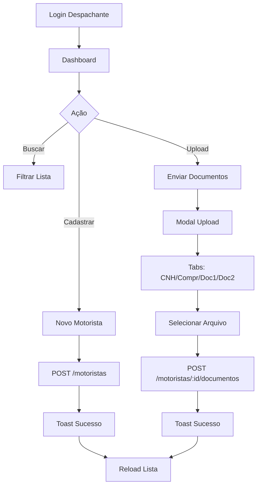

# 🎉 Dashboard Despachante - DespaFacil

## ✅ Funcionalidades Implementadas

### 1. **Listagem de Motoristas**
- ✅ Tabela completa com todas as informações
- ✅ Colunas: Nome, CPF, Email, Curso, Status de cada documento
- ✅ Status visual com badges coloridos para CNH, Comprovante, Doc1, Doc2
- ✅ Paginação e ordenação
- ✅ Responsiva e com scroll horizontal

### 2. **Busca e Filtros**
- ✅ Busca em tempo real por nome ou CPF
- ✅ Filtro por status de documentos (Todos, Pendente, Aprovado, Negado)
- ✅ Contadores visuais na busca

### 3. **Cadastro de Motorista**
- ✅ Modal com formulário completo
- ✅ Campos: Nome, CPF (com máscara), Email, Data Nascimento, Sexo, Identidade, Órgão Emissor, UF, Telefone, Tipo de Curso
- ✅ Validação completa de todos os campos
- ✅ Validação de CPF com algoritmo oficial
- ✅ Validação de email
- ✅ Loading state no botão submit
- ✅ Toast de sucesso/erro
- ✅ Resetar formulário após sucesso
- ✅ Atualização automática da lista

### 4. **Upload de Documentos**
- ✅ Modal dedicado para cada motorista
- ✅ Tabs separadas: CNH, Comprovante, Documento1, Documento2
- ✅ Upload de um arquivo por tipo
- ✅ Formatos aceitos: PDF, JPG, PNG
- ✅ Limite de 10MB por arquivo
- ✅ Validação de tipo e tamanho
- ✅ Feedback visual do arquivo selecionado
- ✅ Mostrar status atual do documento
- ✅ Cards coloridos por status (verde=aprovado, vermelho=negado, amarelo=pendente)
- ✅ Botão de atualizar ou substituir documento
- ✅ Toast de sucesso/erro
- ✅ Atualização automática após upload

### 5. **Estatísticas**
- ✅ Card com total de motoristas
- ✅ Card com documentos pendentes
- ✅ Card com documentos aprovados
- ✅ Cores diferenciadas

### 6. **UI/UX**
- ✅ Design moderno e responsivo
- ✅ Header fixo com logo e logout
- ✅ Botão "Atualizar" com loading state
- ✅ Botão "Novo Motorista" destacado
- ✅ Animações suaves (Framer Motion)
- ✅ Dark mode totalmente suportado
- ✅ Tabela com linhas alternadas e hover
- ✅ Modais com scroll interno
- ✅ Feedbacks visuais claros
- ✅ Ícones intuitivos (Lucide React)

## 📦 Componentes Criados

### **Tabs** (`/components/ui/tabs.tsx`)
- Sistema de abas reutilizável
- Context API para gerenciar estado
- Componentes: Tabs, TabsList, TabsTrigger, TabsContent
- Usado no upload de documentos

### **MotoristaForm** (`/components/dashboard/MotoristaForm.tsx`)
- Formulário completo de cadastro
- Validação em tempo real
- Máscara de CPF automática
- Select de UF com todos os estados
- Integração com backend

### **DocumentoUpload** (`/components/dashboard/DocumentoUpload.tsx`)
- Sistema de tabs para 4 tipos de documentos
- Validação de arquivo (tipo e tamanho)
- Cards coloridos por status
- Feedback visual completo
- Botões de enviar/atualizar

### **DashboardPage** (`/app/dashboard/page.tsx`)
- Página principal do dashboard
- Integração completa com backend
- Gerenciamento de estado
- Modais de cadastro e upload
- Filtros e busca

## 🔌 Integração Backend

### Endpoints Utilizados:
- `GET /api/motoristas` - Listar motoristas
- `POST /api/motoristas` - Cadastrar motorista
- `POST /api/motoristas/:id/documentos` - Upload de documento

## 🎨 Estrutura Visual

```
┌─────────────────────────────────────────────────────────────┐
│  🔹 DespaFacil             👤 Despachante Name   [Sair]     │
├─────────────────────────────────────────────────────────────┤
│                                                             │
│  📊 [5 Motoristas] [3 Pendentes] [8 Aprovados]             │
│                                                             │
│  📊 Motoristas                                              │
│  [Atualizar] [Novo Motorista]                               │
│                                                             │
│  [Buscar por nome ou CPF...] [Status▾]                     │
│                                                             │
│  ┌──────────────────────────────────────────────────────┐  │
│  │ Nome | CPF | Email | Curso | CNH | Compr | D1 | D2 |⚡│  │
│  ├──────────────────────────────────────────────────────┤  │
│  │ João | 123 | j@... | TAC | 🟢 | 🟡 | 🟢 | - |[Upload]│  │
│  └──────────────────────────────────────────────────────┘  │
└─────────────────────────────────────────────────────────────┘
```

## 🚀 Como Testar

### 1. **Login como Despachante**
```
Email: despachante@test.local
Senha: SenhaForte123!
```
*Nota: Você precisará registrar um despachante ou usar o admin para criar um.*

### 2. **Cadastrar Motorista**
- Clique em "Novo Motorista"
- Preencha todos os campos
- Clique em "Cadastrar Motorista"
- Veja o toast de sucesso
- Motorista aparecerá na tabela

### 3. **Upload de Documentos**
- Clique no botão "Upload" do motorista
- Modal abrirá com 4 tabs
- Selecione um arquivo (PDF, JPG ou PNG)
- Clique em "Enviar Documento"
- Veja o toast de sucesso
- Status aparecerá na tabela

### 4. **Buscar e Filtrar**
- Digite nome ou CPF na busca
- Selecione status no filtro
- Tabela atualiza em tempo real

## 📝 Fluxo Completo



## 🎯 Features Destacadas

### ✨ **Máscara de CPF Automática**
```typescript
// Aplica máscara enquanto digita
maskCPF(value) // "12345678900" → "123.456.789-00"

// Valida com algoritmo oficial
validateCPF(cpf) // true/false
```

### ✨ **Upload com Validação**
```typescript
// Valida tipo
allowedTypes: ['application/pdf', 'image/jpeg', 'image/png']

// Valida tamanho
maxSize: 10MB

// Feedback visual
file.name + (file.size / 1024).toFixed(2) + ' KB'
```

### ✨ **Status Visual Intuitivo**
- 🟢 **Verde** = Aprovado
- 🟡 **Amarelo** = Pendente
- 🔴 **Vermelho** = Negado
- **-** = Não enviado

## 🔧 Próximos Passos

**Você pode:**

### 1️⃣ **Testar Integração Completa** (Recomendado)
Fluxo end-to-end:
1. ✅ Login como despachante
2. ✅ Cadastrar motorista
3. ✅ Fazer upload de 4 documentos
4. ✅ Login como admin → Aprovar/Negar
5. ✅ Voltar para dashboard → Ver status atualizado
6. ✅ Enviar certificado
7. ✅ Exportar relatório

### 2️⃣ **Preparar Deploy**
- **Frontend (Vercel):**
  - Conectar repositório
  - Configurar `NEXT_PUBLIC_API_URL`
  - Deploy automático

- **Backend (Railway):**
  - Conectar repositório
  - PostgreSQL add-on
  - Env vars (JWT, DATABASE_URL, SMTP)
  - Deploy automático

---

**Status:** ✅ Dashboard Despachante 100% funcional!
**Próximo:** Teste completo ou Deploy em produção 🚀
